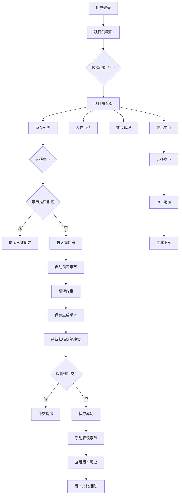

## 1. 产品概述

协作式长篇小说创作平台，支持多位作者共同创作同一部小说，通过章节锁定机制避免编辑冲突，提供完整的版本追溯与差异对比功能，内嵌人物设定和情节线索百科模块，并具备伏笔冲突检测与PDF导出能力。

- 主要解决多人协作创作中的版本冲突、情节连贯性、人物设定一致性等问题
- 目标用户为网络文学作者团队、小说创作工作室、合著作者群体
- 产品价值：提升协作效率，保障创作质量，简化出版流程

## 2. 核心功能

### 2.1 用户角色

| 角色 | 注册方式 | 核心权限 |
|------|----------|----------|
| 项目创建者 | 邮箱/用户名注册 | 创建小说项目、管理作者权限、导出最终版本 |
| 协作作者 | 邀请链接加入 | 编辑未锁定章节、查看历史版本、参与百科编辑 |
| 浏览者 | 邀请链接加入 | 仅查看内容，无编辑权限 |

### 2.2 功能模块

1. **项目主页**：小说列表、项目概览、快速入口
2. **编辑器**：富文本编辑、章节锁定、实时保存
3. **版本管理**：修改历史、版本对比、版本回滚
4. **人物百科**：人物卡片、人物关系图、引用追溯
5. **情节管理**：情节线索、伏笔列表、冲突检测
6. **导出中心**：章节选择、PDF格式配置、导出下载

### 2.3 页面详情

| 页面名称 | 模块名称 | 功能描述 |
|----------|----------|----------|
| 项目主页 | 项目列表 | 展示用户参与的所有小说项目，支持创建新项目 |
| 项目主页 | 项目概览 | 显示小说进度、章节状态、最近活动、团队成员 |
| 章节编辑器 | 章节导航 | 树形章节结构，显示锁定状态、编辑作者 |
| 章节编辑器 | 富文本编辑 | Markdown/富文本混合编辑，自动保存草稿 |
| 章节编辑器 | 锁定管理 | 编辑时自动锁定，完成后手动解锁，显示锁定者 |
| 版本历史 | 提交记录 | 每次修改的作者、时间、修改摘要列表 |
| 版本历史 | 差异对比 | 并排显示两个版本，高亮新增/删除/修改内容 |
| 人物百科 | 人物列表 | 所有人物卡片，支持筛选、搜索 |
| 人物百科 | 人物详情 | 人物设定、出场章节、人物关系、引用标记 |
| 情节管理 | 线索列表 | 关键情节走向、伏笔记录、关联章节 |
| 情节管理 | 冲突检测 | 扫描新章节内容，检测与已有伏笔的冲突 |
| 导出中心 | 章节选择 | 多选需要导出的章节，支持排序调整 |
| 导出中心 | PDF配置 | 封面、目录、页码、字体、边距设置 |

## 3. 核心流程

用户登录后进入项目列表，选择或创建小说项目。在项目中查看章节列表，选择未锁定的章节进入编辑器。编辑时系统自动锁定该章节防止他人同时编辑。每次保存自动生成版本记录，可随时查看历史版本并进行差异对比。

在创作过程中，作者可以在人物百科中维护角色设定，在情节管理中记录伏笔和关键情节。当编辑的章节内容涉及已有人物或伏笔时，系统自动提示关联信息；当内容可能与已有伏笔冲突时，发出警告提示。

完成创作后，用户可进入导出中心，选择需要导出的章节，配置PDF格式，最终生成并下载完整的小说PDF文件。

## 4. 用户界面设计

### 4.1 设计风格

- **主色调**：深邃墨蓝 (#1e3a5f) 搭配暖金色 (#d4af37)，营造文学创作的典雅氛围
- **辅助色**：米白 (#f8f5f0) 背景，深灰 (#2c3e50) 文字，砖红 (#c0392b) 标记冲突
- **按钮风格**：圆角8px，悬浮时微浮起动效，主按钮渐变填充
- **字体**：标题使用「思源宋体」，正文使用「思源黑体」，编辑器使用「JetBrains Mono」等宽字体
- **布局风格**：三栏布局（左侧导航、中间编辑区、右侧信息面板），卡片式信息展示
- **图标风格**：线性图标，统一2px描边，金色点缀

### 4.2 页面设计概述

| 页面名称 | 模块名称 | UI元素 |
|----------|----------|--------|
| 项目主页 | 项目卡片 | 悬浮上浮效果、进度条、成员头像组、金色边框高亮活跃项目 |
| 章节编辑器 | 三栏布局 | 左：章节树（带锁定图标），中：编辑区（仿纸张质感背景），右：实时面板 |
| 版本历史 | 时间轴 | 左侧时间轴，右侧版本卡片，差异区红绿高亮对比 |
| 人物百科 | 卡片网格 | 人物头像卡片，点击展开详情抽屉，关系图力导向布局 |
| 情节管理 | 看板布局 | 伏笔卡片可拖拽，冲突警告砖红色边框闪烁提示 |
| 导出中心 | 向导式 | 步骤指示器，章节拖拽排序，实时预览缩略图 |

### 4.3 响应式

- **桌面端**（1200px+）：完整三栏布局，所有功能完整呈现
- **平板端**（768px-1200px）：两栏布局，右侧面板可折叠收起
- **移动端**（<768px）：单栏流式布局，底部Tab导航，编辑区全屏展示，优化触摸操作
- 所有交互元素最小44x44px触摸区域，关键操作二次确认

### 4.4 动效设计

- 页面加载：内容区域淡入上滑，延迟交错呈现
- 章节锁定：锁定图标旋转出现，编辑区边框金色脉冲动画
- 冲突提示：警告卡片左右轻摇，文字逐字显现
- 版本对比：差异内容渐进式高亮，从旧到新过渡
- 人物卡片：悬停时3D微翻转，展开时抽屉平滑滑入
