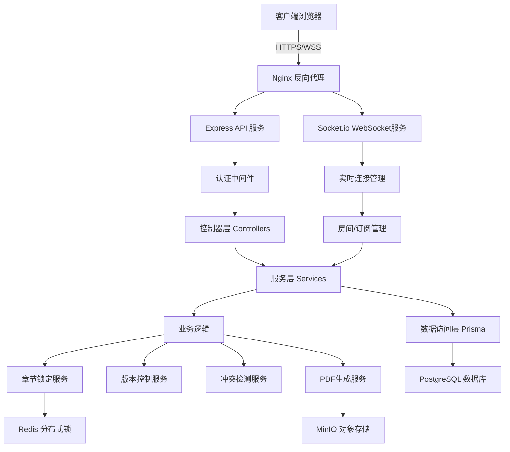
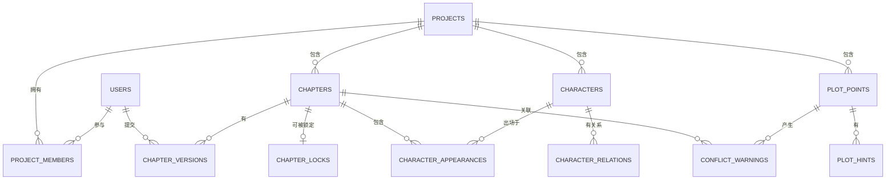

## 1. 架构设计

本项目采用前后端分离的单页应用架构，前端负责交互展示与本地数据缓存，后端提供RESTful API与数据持久化。使用WebSocket实现章节锁定状态与协作信息的实时同步。

```mermaid
graph TD
    A["前端 React 应用"] --> B["状态管理 Redux Toolkit"]
    A --> C["路由 React Router"]
    A --> D["UI组件库 自定义 + Tailwind"]
    A --> E["编辑器 Tiptap + Markdown"]
    A --> F["实时通信 Socket.io Client"]
    A --> G["PDF生成 jsPDF + html2canvas"]
    
    H["后端 Node.js + Express"] --> I["RESTful API"]
    H --> J["WebSocket服务 Socket.io"]
    H --> K["认证中间件 JWT"]
    H --> L["业务逻辑层"]
    
    M["数据层"] --> N["PostgreSQL 主数据"]
    M --> O["Redis 缓存/锁定状态"]
    M --> P["对象存储 版本快照/PDF"]
    
    Q["外部服务"] --> R["Email 邀请通知"]
    Q --> S["文件存储 MinIO"]
```



## 2. 技术描述

- **前端**：React@18 + TypeScript + Vite + TailwindCSS@3 + Redux Toolkit
- **后端**：Node.js + Express@4 + TypeScript + Prisma ORM
- **数据库**：PostgreSQL 15（主数据）+ Redis 7（缓存/分布式锁）
- **实时通信**：Socket.io@4
- **富文本编辑**：Tiptap@2 + ProseMirror
- **PDF导出**：jsPDF + html2canvas
- **版本控制**：自定义diff算法，基于diff-match-patch
- **对象存储**：MinIO（本地部署）或AWS S3
- **认证**：JWT + bcrypt

## 3. 路由定义

| 路由 | 页面/组件 | 功能说明 |
|------|----------|----------|
| /login | 登录页 | 用户登录、注册入口 |
| /projects | 项目列表 | 展示所有项目，创建新项目 |
| /projects/:id | 项目概览 | 项目信息、进度、成员管理 |
| /projects/:id/chapters | 章节列表 | 章节树、状态展示、新建章节 |
| /projects/:id/chapters/:chapterId | 章节编辑器 | 富文本编辑、锁定控制、实时保存 |
| /projects/:id/chapters/:chapterId/history | 版本历史 | 历史版本列表、版本对比、回滚 |
| /projects/:id/characters | 人物百科 | 人物列表、详情、关系图 |
| /projects/:id/plot | 情节管理 | 伏笔列表、情节线索、冲突检测 |
| /projects/:id/export | 导出中心 | 章节选择、PDF配置、生成下载 |

## 4. API 定义

```typescript
// 项目相关类型
interface Project {
  id: string;
  title: string;
  description: string;
  coverImage?: string;
  creatorId: string;
  createdAt: Date;
  updatedAt: Date;
  members: ProjectMember[];
}

interface ProjectMember {
  userId: string;
  role: 'creator' | 'author' | 'viewer';
  joinedAt: Date;
}

// 章节相关类型
interface Chapter {
  id: string;
  projectId: string;
  title: string;
  content: string;
  order: number;
  parentId?: string;
  isLocked: boolean;
  lockedBy?: string;
  lockedAt?: Date;
  createdAt: Date;
  updatedAt: Date;
  versions: ChapterVersion[];
}

interface ChapterVersion {
  id: string;
  chapterId: string;
  content: string;
  authorId: string;
  changeSummary: string;
  diff?: string;
  createdAt: Date;
}

// 人物相关类型
interface Character {
  id: string;
  projectId: string;
  name: string;
  avatar?: string;
  description: string;
  traits: Record<string, string>;
  relationships: CharacterRelation[];
  appearances: string[]; // chapter IDs
  createdAt: Date;
  updatedAt: Date;
}

interface CharacterRelation {
  targetId: string;
  type: string;
  description: string;
}

// 情节相关类型
interface PlotPoint {
  id: string;
  projectId: string;
  title: string;
  description: string;
  type: 'foreshadow' | 'climax' | 'turning' | 'ending';
  status: 'pending' | 'active' | 'resolved';
  relatedChapters: string[];
  relatedCharacters: string[];
  hints: string[];
  createdAt: Date;
}

interface ConflictWarning {
  id: string;
  chapterId: string;
  plotPointId: string;
  severity: 'info' | 'warning' | 'error';
  message: string;
  location?: { line: number; column: number };
}

// API Endpoints
// GET    /api/projects              获取项目列表
// POST   /api/projects              创建新项目
// GET    /api/projects/:id          获取项目详情
// PUT    /api/projects/:id          更新项目信息
// GET    /api/projects/:id/chapters 获取章节列表
// POST   /api/projects/:id/chapters 创建新章节
// GET    /api/chapters/:id          获取章节详情
// PUT    /api/chapters/:id          更新章节内容
// POST   /api/chapters/:id/lock     锁定章节
// POST   /api/chapters/:id/unlock   解锁章节
// GET    /api/chapters/:id/history  获取版本历史
// POST   /api/chapters/:id/versions 创建新版本
// GET    /api/versions/:id/diff     获取两个版本差异
// POST   /api/versions/:id/rollback 版本回滚
// GET    /api/projects/:id/characters 获取人物列表
// POST   /api/projects/:id/characters 创建人物
// GET    /api/projects/:id/plot     获取情节线索
// POST   /api/projects/:id/plot/check 检测冲突
// POST   /api/export/pdf            导出PDF
```

## 5. 服务器架构图



## 6. 数据模型

### 6.1 数据模型定义



### 6.2 数据定义语言

```sql
-- 用户表
CREATE TABLE users (
    id UUID PRIMARY KEY DEFAULT gen_random_uuid(),
    username VARCHAR(50) UNIQUE NOT NULL,
    email VARCHAR(255) UNIQUE NOT NULL,
    password_hash VARCHAR(255) NOT NULL,
    avatar_url VARCHAR(512),
    created_at TIMESTAMPTZ NOT NULL DEFAULT NOW(),
    updated_at TIMESTAMPTZ NOT NULL DEFAULT NOW()
);

-- 项目表
CREATE TABLE projects (
    id UUID PRIMARY KEY DEFAULT gen_random_uuid(),
    title VARCHAR(255) NOT NULL,
    description TEXT,
    cover_image_url VARCHAR(512),
    creator_id UUID NOT NULL REFERENCES users(id),
    created_at TIMESTAMPTZ NOT NULL DEFAULT NOW(),
    updated_at TIMESTAMPTZ NOT NULL DEFAULT NOW()
);

-- 项目成员表
CREATE TABLE project_members (
    id UUID PRIMARY KEY DEFAULT gen_random_uuid(),
    project_id UUID NOT NULL REFERENCES projects(id) ON DELETE CASCADE,
    user_id UUID NOT NULL REFERENCES users(id) ON DELETE CASCADE,
    role VARCHAR(20) NOT NULL CHECK (role IN ('creator', 'author', 'viewer')),
    joined_at TIMESTAMPTZ NOT NULL DEFAULT NOW(),
    UNIQUE(project_id, user_id)
);

-- 章节表
CREATE TABLE chapters (
    id UUID PRIMARY KEY DEFAULT gen_random_uuid(),
    project_id UUID NOT NULL REFERENCES projects(id) ON DELETE CASCADE,
    parent_id UUID REFERENCES chapters(id) ON DELETE SET NULL,
    title VARCHAR(255) NOT NULL,
    content TEXT NOT NULL DEFAULT '',
    "order" INTEGER NOT NULL DEFAULT 0,
    created_at TIMESTAMPTZ NOT NULL DEFAULT NOW(),
    updated_at TIMESTAMPTZ NOT NULL DEFAULT NOW()
);

-- 章节锁定表
CREATE TABLE chapter_locks (
    chapter_id UUID PRIMARY KEY REFERENCES chapters(id) ON DELETE CASCADE,
    user_id UUID NOT NULL REFERENCES users(id),
    locked_at TIMESTAMPTZ NOT NULL DEFAULT NOW(),
    expires_at TIMESTAMPTZ NOT NULL DEFAULT NOW() + INTERVAL '30 minutes'
);

-- 章节版本表
CREATE TABLE chapter_versions (
    id UUID PRIMARY KEY DEFAULT gen_random_uuid(),
    chapter_id UUID NOT NULL REFERENCES chapters(id) ON DELETE CASCADE,
    content TEXT NOT NULL,
    author_id UUID NOT NULL REFERENCES users(id),
    change_summary VARCHAR(500),
    diff_patch TEXT,
    created_at TIMESTAMPTZ NOT NULL DEFAULT NOW()
);

-- 人物表
CREATE TABLE characters (
    id UUID PRIMARY KEY DEFAULT gen_random_uuid(),
    project_id UUID NOT NULL REFERENCES projects(id) ON DELETE CASCADE,
    name VARCHAR(100) NOT NULL,
    avatar_url VARCHAR(512),
    description TEXT NOT NULL DEFAULT '',
    traits JSONB NOT NULL DEFAULT '{}',
    created_at TIMESTAMPTZ NOT NULL DEFAULT NOW(),
    updated_at TIMESTAMPTZ NOT NULL DEFAULT NOW()
);

-- 人物关系表
CREATE TABLE character_relations (
    id UUID PRIMARY KEY DEFAULT gen_random_uuid(),
    character_id UUID NOT NULL REFERENCES characters(id) ON DELETE CASCADE,
    target_id UUID NOT NULL REFERENCES characters(id) ON DELETE CASCADE,
    relation_type VARCHAR(50) NOT NULL,
    description TEXT,
    UNIQUE(character_id, target_id, relation_type)
);

-- 人物出场表
CREATE TABLE character_appearances (
    id UUID PRIMARY KEY DEFAULT gen_random_uuid(),
    character_id UUID NOT NULL REFERENCES characters(id) ON DELETE CASCADE,
    chapter_id UUID NOT NULL REFERENCES chapters(id) ON DELETE CASCADE,
    context TEXT,
    created_at TIMESTAMPTZ NOT NULL DEFAULT NOW(),
    UNIQUE(character_id, chapter_id)
);

-- 情节点表
CREATE TABLE plot_points (
    id UUID PRIMARY KEY DEFAULT gen_random_uuid(),
    project_id UUID NOT NULL REFERENCES projects(id) ON DELETE CASCADE,
    title VARCHAR(255) NOT NULL,
    description TEXT NOT NULL DEFAULT '',
    point_type VARCHAR(20) NOT NULL CHECK (point_type IN ('foreshadow', 'climax', 'turning', 'ending')),
    status VARCHAR(20) NOT NULL DEFAULT 'pending' CHECK (status IN ('pending', 'active', 'resolved')),
    created_at TIMESTAMPTZ NOT NULL DEFAULT NOW()
);

-- 伏笔线索表
CREATE TABLE plot_hints (
    id UUID PRIMARY KEY DEFAULT gen_random_uuid(),
    plot_point_id UUID NOT NULL REFERENCES plot_points(id) ON DELETE CASCADE,
    chapter_id UUID REFERENCES chapters(id) ON DELETE SET NULL,
    hint_text TEXT NOT NULL,
    location_description VARCHAR(255),
    created_at TIMESTAMPTZ NOT NULL DEFAULT NOW()
);

-- 冲突警告表
CREATE TABLE conflict_warnings (
    id UUID PRIMARY KEY DEFAULT gen_random_uuid(),
    chapter_id UUID NOT NULL REFERENCES chapters(id) ON DELETE CASCADE,
    plot_point_id UUID REFERENCES plot_points(id) ON DELETE SET NULL,
    character_id UUID REFERENCES characters(id) ON DELETE SET NULL,
    severity VARCHAR(20) NOT NULL CHECK (severity IN ('info', 'warning', 'error')),
    message TEXT NOT NULL,
    line_number INTEGER,
    column_number INTEGER,
    created_at TIMESTAMPTZ NOT NULL DEFAULT NOW(),
    resolved BOOLEAN NOT NULL DEFAULT FALSE,
    resolved_at TIMESTAMPTZ
);

-- 索引
CREATE INDEX idx_chapters_project_id ON chapters(project_id);
CREATE INDEX idx_chapter_versions_chapter_id ON chapter_versions(chapter_id);
CREATE INDEX idx_characters_project_id ON characters(project_id);
CREATE INDEX idx_plot_points_project_id ON plot_points(project_id);
CREATE INDEX idx_conflict_warnings_chapter_id ON conflict_warnings(chapter_id);
```
